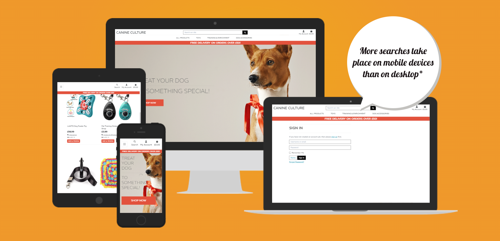

<h1 align="center">Canine Culture</h1>

<h2 align="center"> A Dog Store Site</h2>

<h2 align="center">Milestone Project 4 - Lee Smith</h2>

## 
[Canine Culture Live Site](https://canine-culture-f3db279cab51.herokuapp.com/)

## 
[Canine Culture Repository](https://github.com/leellismith/Canine-Culture)

# UXD

# Purpose of the Project

# User Stories

#### __User Story: Online Dog Store__

As a User (Customer),
I want to easily browse and purchase toys for my dog from a wide selection of high-quality, fun, and safe products.So that I can keep my pets entertained and happy, while enjoying a seamless online shopping experience.
Acceptance Criteria:
1. I can search for toys by category (type of toy, lead,  harness, Clickers & 
 Whistles, Treat Pouches etc).
2. I can view detailed product descriptions, images, prices, and reviews.
3. I can filter and sort products based on popularity, price, or user rating.
4. I can securely add products to my cart, checkout, and select delivery options.
5. I can remove products from my cart.
6. I can update the products in my cart.
7. I can remove products in my cart.
8. I can register an account and received a confirmation email.
9. I can log in and out of my account.
10. I can add my personal details to my account to make the checkout easier.
11. I can update my personal details.
12. I can see all my orders whilst I’m logged in.
13. I can be sure that my payment info is secure.
14. I can see how much my total will be.
15. I can see how much the delivery will be.
16. I can added items to a wishlist.
17. I can remove items from my wishlist.
18. I can add a review on a item.
19. I can view all my reviews.
20. I can Edit any of my reviews.
21. I can delete any of my reviews.

As the website admin and seller
I want to easily upload and manage my inventory of dog items, track orders, and update product information. So that I can efficiently sell and promote my products on the Website.
Acceptance Criteria:
1. I can add new products with images, descriptions, prices.
2. I can update product details in real time.
3. I can delete products in real time. 
4. I can monitor customer reviews and delete if they are inappropriate.
5. I can monitor customer service interactions for quality assurance.
6. I can manage user disputes and issue refunds when necessary.

## Steps to be taken

1. Research websites.
2. Sketch up designs.
3. Create wireframes designs.
4. Create Database
4. find mixed content that works together (Colour Scheme, Font Styles and Background).
5. Find how the content will work together.
6. Design Website.
7. Create Website ()
8. Test website.
9. Deploy Website.

# Features and User Experience

* __Background Image__
    > The background image was selected as the colour and theme of the image would fit in with the design. 

* __Search Bar__
    > The Search bar is included in the NavBar to give the user a easy search function to be able to find what they are looking for.

* __Products Page__
    > The user has category options to find a item. Once selected it will be opened up in to a update to date products page where the user can see the image, name, price, category and rating with a nice Add to wishlist button. 
    
    > Once the user clicks on a item, they would go through to the products detail page where there will be again the image, name, price, category and rating but with a fun description. This is where the user can add to the bag and select the quantity, add to wishlist or just keep shopping.

    > This is also where a login user can add a review to the site with a Rating and a comment and to be able to see a the reviews next to it.

    > On these pages the Owner/Admin will be able to Edit or Delete products.

* __Shopping Bag Page__
    > When the user wants to check out the bag, they will be able to click the bag icon in the top right on the page, this will navigate the use to the Shopping bag where they will be able to view the bag update the quantity which will update the pricing automatically. The user can also remove any unwanted items from the bag at this point.

* __Checkout Page__
    > When the user clicks the secure checkout button on the shopping bag page they will be sent to the checkout page. On this page the user will be able to see a Order summary with the order total, delivery and grand total.

    > The user will have to complete the form with the Full Name, Email Address and delivery address.

    > The next part is where the user will add the payment information and then click the complete order button which will use stripe secure payment service.

* __Wishlist Page__
    > If the user has added items to the wishlist, they will be able to view this page by clicking on the icon in the top right of the navbar. On this page the user will be able to view the item as viewed in the products page. with the option to remove the item if it's not needed no more.

* __Reviews page__
    > Once the user has added a review in the product details page, the user will be able to view all thier reviews if they click of my account in the navbar and click on my reviews. Here the user can see all the review they have made with the option to edit the review or delete the review.

* __Profile Page__
    > The Profile page is basic but has good uses, this is where the user can update the default delivery information in need and can also view the order history of what they have bought.

* __Order Information__
    > When the user clicks on a order in order history they will be able to view all the order information from that order.

* __Add Products Page__
    > When the Site Worker/Admin wants to add a product they will be able to do this with ease through the sites Product Management link found in the My Account icon.

    > Here is where you will be able to select the category of the item, give it a SKU number, name, description, price, Rated(if needed) and add the image url and or add a image file.

* __Edit Products Page__
    > The site worker/admin can also edit any detail of a product either by search or going in to the category links. Here is where you can amend any of the information as stated in the Add Products page.

## Future Features

* Pet Profiles - Allows customers to created a profile for their dog with information like age, size.

* Wishlist Sharing - Allows users to share wishlist with friends or family.

* Loyalty points program - Users can earn point for purchases to be able to redeem on the next order or save them up.

* User Content - To have a page where users can upload video/picture of the pet enjoying the product.

* Impoved Review system - Where the user can upload a image to the review.

* Checkout Add-on - Show related or complementary prodicts for the user to add before checkout.

# Typography and Color Scheme

The Typography used -

* Font Family - REM

The Colour Scheme will include of HEX colours -

* `#e94f37 - Orange`
* `#fff - White`
* `#3a3e41 - Dark Grey`

# Wireframes

## Mobile Wireframe

## Tablet Wireframe

## Desktop Wireframe

# Technology
* __HTML__
* __CSS__
* __Python__
* __JavaScript__
* __jquery__
* __Bootstrap__
* __Django__
* __Stripe__
* __AWS__
* __Heroku__
* __Font Awesome__
* __Google Fonts__
* __Git__
* __GitHub__
* __Figma__
* __favicon__

# Testing

## Code Validation

### __W3 Validator__

#### __Home Page__

#### __Login Page__

#### __Profile Page__

#### __Reviews Page__

#### __Wishlist Page__

#### __Bag Page__

#### __Products Page__

#### __Add Products Page__

#### __Edit Products Page__

#### __CSS Validation__

## __Lighthouse Testing__

#### __Home Page__

#### __Profile Page__

#### __Reviews Page__

#### __Wishlist Page__

#### __Bag Page__

#### __Products Page__

#### __Add Products Page__

* As you can see that all the LightHouse Testing that the best practices test is always at 78. I couldn't work at the cause as when looking in to it, the general issue is Uses third-party cookies.

## __JS Hint__

#### After testing with JS Hint there were no major issues found.

## __CI Python Linter Testing__

#### __Profile Page__

#### __Reviews Page__

#### __Wishlist Page__

#### __Bag Page__

#### __Products Page__

#### __Checkout Page__

# Data Schema

You will find below a list of Data schema's which will show you how data is stored.

#### Product Schema

| Column Name | Data Type | Description |
|--- |--- |--- |
| sku | String (PK) | Stock Keeping Unit, unique identifier for each product.|
| name | String | Name of the product. |
| category | String (FK) | Category identifier (e.g., toys, accessories). |
| price | Decimal | Cost of the product (e.g., 19.99). |
| rating | Decimal | Average rating of the product (e.g., 4.5). |
| description | Text | Detailed description of the product. |
| image | String | URL path to the product image. |

#### User Schema

| Column Name | Data Type | Description |
|--- |--- |--- |
| username | String | Username of the user. |
| email | String | User's email address. |
| password | String | Hashed password for user authentication. |
| is_staff | Boolean | Indicates if the user has admin/staff privileges. |
| is_active | Boolean | Indicates if the user account is active. |
| is_superuser | Boolean | Indicates if the user has superuser privileges. |
| date_joined | DateTime | Date when the user registered. |

#### Email Schema 

| Column Name | Data Type | Description |
|--- |--- |--- |
| email | String | User's email address. |
| user_id | Integer (FK) | Reference to the user who owns this email address. |
| verified | Boolean | Indicates if the email address has been verified. |
| primary | Boolean | Indicates if this is the user's primary email address. |

#### Order Schema

| Column Name | Data Type | Description |
|--- |--- |--- |
| order_number | String (PK) | Unique identifier for each order. |
| user_profile | Integer (FK) | Reference to the user who placed the order. |
| date | DateTime | Timestamp when the order was created. |
| full_name | String | Full name of the recipient. |
| email | String | Email address of the recipient. |
| phone_number | String | Phone number of the recipient. |
| country | String | Country for delivery |
| postcode | String | Postcode/ZIP for delivery. |
| town_or_city | String | Town or city for delivery. |
| street_address1 | String | Primary street address for delivery. |
| street_address2 | String | Secondary street address (optional). |
| county | String | County/State for delivery. |
| delivery_cost | Decimal | Cost of shipping/delivery. |
| order_total | Decimal | Total cost of the items in the order. |
| grand_total | Decimal | Total cost including delivery |
| original_bag | Text | JSON or serialized data of the original shopping bag. |
| stripe_pid | String | Stripe Payment Intent ID associated with the order. |

#### Review Schema

| Column Name | Data Type | Description |
|--- |--- |--- |
| id | Integer (PK) | Unique identifier for each review. |
| user | Integer (FK) | Reference to the user who wrote the review. |
| product | Integer (FK) | Reference to the product being reviewed. |
| rating | String | Numeric rating given by the user (e.g., 1 to 5). |
| comment | String | Textual feedback or comment about the product. |
| date_created | String | Timestamp when the review was submitted. |

# User Testing

| Users | Results | Fixed Issues |
|--- |--- |--- |
| First User | User found issue with styling when testing on mobile within the nav dropdown  | Issue fixed by adding the correct styling names |
| Second User | User found bug where the minus button and plus button didn't disable in the bag | Fix issue by changing the id atttributes for the quantity input and buttons to class |
| Third User | No Issues Found | N/A |
| Fourth User | No Issues Found | N/A |
| Fifth User | No Issues Found | N/A |

# Manual Testing

#### General Usability Test

* All Navgation links work correctly across devices and screen sizes.
* Responsiveness tested across mobile, tablet desktop to make sure everything scales and looks good.

#### User Authentication Test

* Testing Login/sign to ensure users can create accounts log in and out without issues with email verification.
* Email verification tested and works correctly.

#### Shopping Process Test

* Tested the Product seach and filter feature was working as expected.
* All product images, description and prices are accurate.
* Add to bag tested by added, removing and updating the items in the bag.
* Wishlist tested by adding and removing items from the wishlist page.

#### Checkout Process Test

* Tested that the billing and shipping forms are validated and tested with valid and invalid data.
* Tested Stripe with various test cards and also ensure webhooks worked also.
* Tested that the order confirmation were confirmed and also the correct data was store for users to be able to view.

#### Product Reviews

* Testing products reviews by adding, editing and deleting reviews and also made sure only authorised users can edit/delete reviews. Included admin in the django admin.

#### Profile Test

* Tested that users can update their delivery address with no issues.
* Tested that users can view previous orders with full order details.

#### Admin Add/Edit/Delete Products

* Tested that superusers are able to add a product without any issues.
* Tested that superusers are able to edit a product without any issues.
* Tested that superusers are able to delete a product without any issues.

# Fixed Bugs

* Had issue with the automatic email being sent out but was was showing the sender at example.com. after a while of fixing and researching I found that the site names in Django were not set to the automatic email didn't know what to put in the infills. After added the correct name and testing again it all was fine.

* The was a bug with the wishlist redirect on the product page where I wanted the wishlist button to be able to redirect the user back to the page they were on but everytime you would click on wishlist and then login the product page would show 0 products. After multiple attemps of getting this to work, I decided to just redirect the user back to the products page instead of being specific. This fixed the issue but the user does lose where they were on the site. 

* I had a 404 webmanifest error popping up in the console and after about an hour of dedugging and research, I found the issue can from favicon link tags that were supplied on the site had a webmanifest link but I was able to remove this link from the corecss and still have the favicons work.

* I had a bug where only authenticated user were able to checkout on the site and when anonymous users tried to place a order on the site would return error 500. I noticed that in my Checkout/views.py at the def checkout, the code was always trying to save the order to a profile. After some researching on the error code and searching on stackoverflow. I found if I put "if request.user.is_authenticated" line starting above the profile and ending in user_profile_form.save() in a if statement I would be able to check if the user has a profile or is a guest checking out. If a guest then tries to order it will skip the code to add the order to a profile but still enables a authenticated users to add orders to profile.

### Supported Screens and Browsers

| Screens | Supported |
|---|---|
| Phone | Yes
| Tablet | Yes |
| Laptop | Yes |
| Desktop | Yes |
---
Browsers | Supported|
|---| ---|
| Google Chrome | Yes |
| Safari | Yes |
| Firefox | Yes |
| Mircosoft Edge | Yes |
---

# Deployment

## Heroku Deployment
[Heroku](https://dashboard.heroku.com/) was used for The Canine Culture project. Heroku is a cloud platform that allows developers to build, run, and operate applications entirely in the cloud.

To deploy your own, follow these steps -

1. Select __New__ in the top-right corner of your Heroku Dashboard, and select __Create new app__ from the dropdown menu.
2. Your app name must be unique, and then choose a region closest to you (EU or USA), and finally, select __Create App__.
3. From the new app __Settings__, click __Reveal Config Vars__, and set your environment variables.

| Key | Value |
| --- | --- |
| `DATABASE_URL` | user's own value |
| `IP` | 0.0.0.0 |
| `MONGO_DBNAME` | user's own value |
| `MONGO_URI` | user's own value |
| `PORT` | 5000 |
| `SECRET_KEY` | user's own value |

4. Heroku needs two additional files in order to deploy properly.
- requirements.txt
- Procfile

5. You can install this project's __requirements__ (where applicable) using:

- `pip3 install -r requirements.txt`

6. If you have your own packages that have been installed, then the requirements file needs updated using:

- `pip3 freeze --local > requirements.txt`

7. The **Procfile** can be created with the following command:

- `echo web: python app.py > Procfile`
- *replace __app.py__ with the name of your primary Flask app name; the one at the root-level*

NOTE: The Procfile uses a capital P and doesn't have a file extension on the end.

8. For Heroku deployment, follow these steps to connect your own GitHub repository to the newly created app:

Either:

- Select __Automatic Deployment__ from the Heroku app.

9. Or:

- In the Terminal/CLI, connect to Heroku using this command: `heroku login -i`
- Set the remote for Heroku: `heroku git:remote -a app_name` (replace *app_name* with your app name)
- After performing the standard Git `add`, `commit`, and `push` to GitHub, you can now type:
	- `git push heroku main`

The project should now be connected and deployed to Heroku!

## Gitpod.io Deployment

>1. Go to github.
>2. Find Canine-Culture repository or [Click Here](https://github.com/leellismith/Canine-Culture).
>3. Click on the green <> Code button.
>4. In the dropdown you will find the HTTP url. Copy that.
>5. Load up [Gitpod](https://gitpod.io/)
>6. Once logged in, Select Orange new workspace button.
>7. Click on select a respository.
>8. Paste in the repository. See steps 1 - 4.
>9. Click continue.
>10. Your workspace has been set up.
___
 __Making a Clone__

 >1. Follow steps 1 - 4 from the Gitpod.io deployment steps.
 >2. Open your Terminal.
 >3. Select a location where you would like the clone to save to.
 >4. Type __git clone__ and paste the respository.
 >5. Press Enter to create your local clone.

 # Credits

 To start the project I followed through the Boutique Ado Project created by [Code Institute](https://codeinstitute.net/).

 Background image was found and used from [freepik.com](https://www.freepik.com/free-photo/thoughtful-attentive-dog-wearing-red-bow-close-up-shot-isolated-white_11829594.htm#from_view=detail_alsolike).

 When creating my wishlist model I took inspiration from a video called [Add Product to Wishlist](https://www.youtube.com/watch?v=pdttUeJi7j8).

 Also took inspiration when creating the review model from [Review and Rating in Django](https://www.youtube.com/watch?v=reFJ9hBLFUY&t=167s).

[Bootstrap](https://getbootstrap.com/) was used throughout my site.

All Items found on site where taken from [Amazon](https://www.amazon.co.uk/).